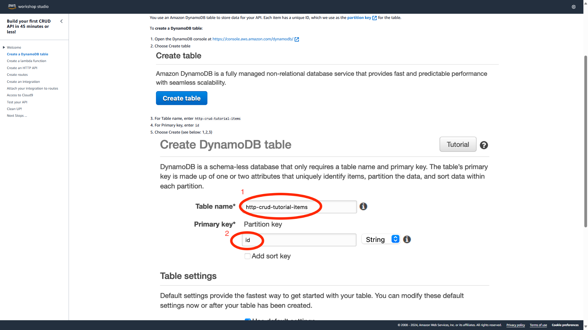

A primeira coisa necessaria para construir essa API foi a criação de um DynamoDB. O mesmo seria usado para guardarmos os dados da API, essencialmente agindo como o mongodb, se fosse comparar com a API que fiz no progresse report anterior.

O segundo passo foi criar uma função lambda, esta seria responsável por criar,ler,atualizar e deletar dados do nosso banco criado no DynamoDB

O terceiro passo trata-se de criar um API gateaway, esta é responsavel por receber as requisições dos usuarios.

Com esses 3 criados, a aplicação funciona basicamente da seguinte maneira:
1- o usuario faz uma solicitação para a API gateaway 
2- a API gateaway envia a solicitação para a função lambda
3- a função lambda acessa o DynamoDB e realiza o que a solicitação do usuario pediu
4- a função retorna uma resposta para a API gateaway, confirmando se a tarefa foi ou nao realizada
5- a API gateaway retorna a resposta para o usuario